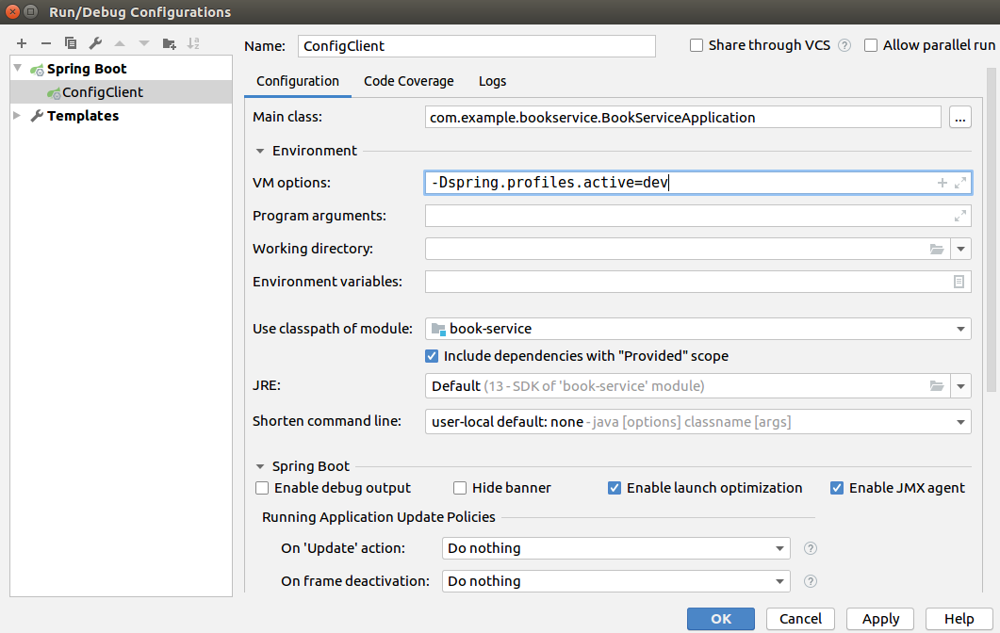

# Spring Cloud Config Server

Spring Cloud Config Server предоставляет централизованный сервер конфигурации для микросервисов, основанных на Spring Cloud.

Чтобы нужные файлы настроек успешно находились, ваш Config Client должен быть обязательно запущен с одним из трех профилей: dev, master или test.
Способ указать, какой профиль мы хотим использовать для клиента, является окно конфигурации запуска.

Параметр -Dspring.profiles.active=dev говорит spring boot, что это приложение должно быть запущено именно с этим профилем.